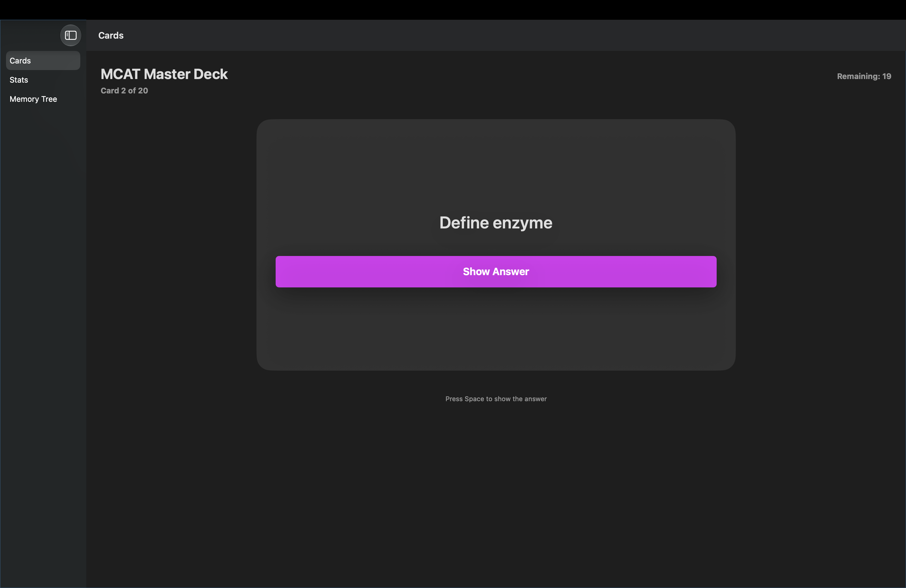
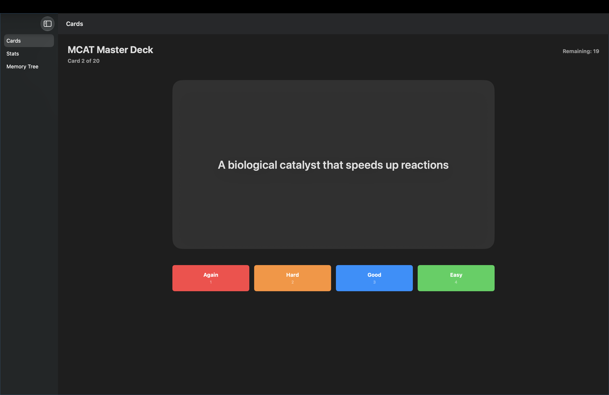
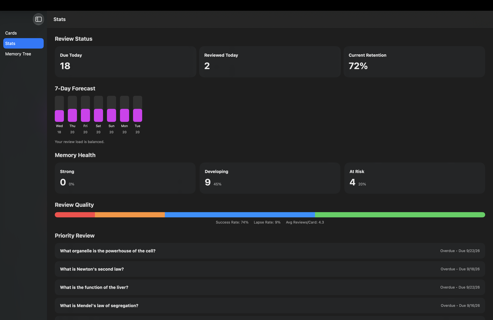
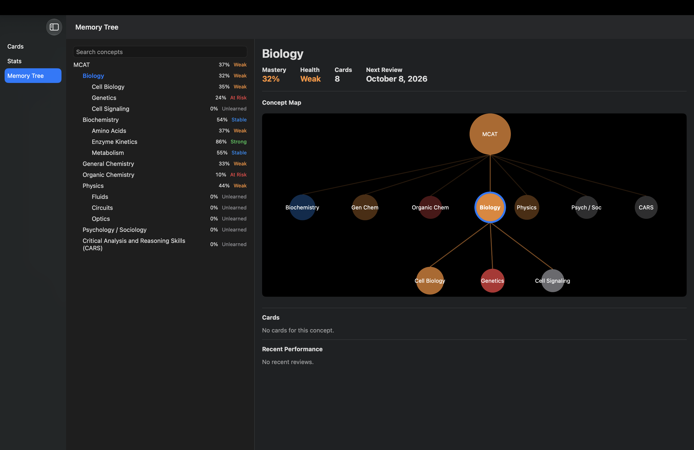

# Recall

Recall is a macOS study app built with SwiftUI.

It combines spaced review, learning analytics, and a Memory Tree that organizes cards by concept.

## Features

* Flashcard review with Again, Hard, Good, and Easy ratings
* Review scheduling and progress tracking
* Study analytics and retention metrics
* Hierarchical Memory Tree for concept mastery
* Search and weak topic identification
* Local JSON persistence

## Tech

Swift  
SwiftUI  
Xcode  
Foundation  
Combine

## Project Focus

Recall explores a simple idea:

**Studying should show you what you know, what is fading, and what to review next.**

The current version is actively being developed.

## Screenshots

### Review




### Analytics


### Memory Tree


## Run

```bash
git clone https://github.com/klaurend1/recall-adaptive-learning-system.git
cd recall-adaptive-learning-system
open Recall.xcodeproj
```

Built by **Keith Laurendine Jr.**
